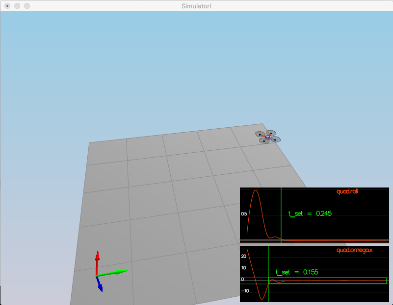
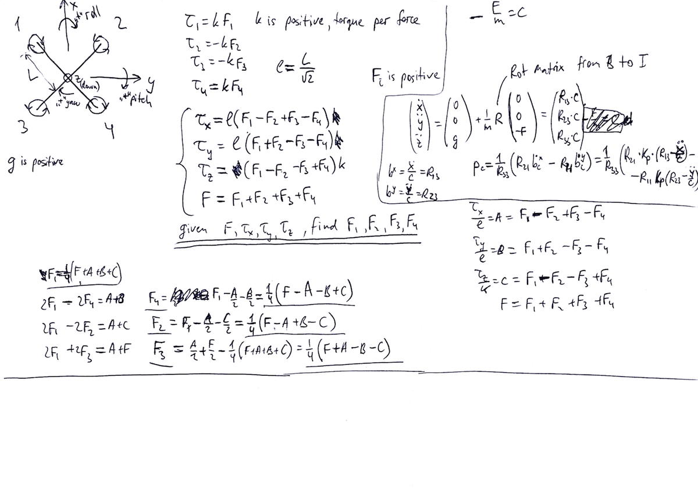

# Project Write-up: 3D Quad Control

---
#### 1. Provide a Writeup / README that includes all the rubric points and how you addressed each one.  You can submit your writeup as markdown or pdf.

You're reading it!
Here I will consider the [rubric](https://review.udacity.com/#!/rubrics/1643/view)
points individually and describe how I addressed each point in my implementation.


### Implement Controller


#### 1. Implemented body rate control in C++

Requirements:
* should be a proportional controller on body rates
* command moments
* should take into account the moments of inertia

And it is indeed a really simple piece of code:

```cpp
  V3F err = pqrCmd - pqr;
  momentCmd = kpPQR * err * V3F(Ixx, Iyy, Izz);
```

#### 2. Implement roll pitch control in C++

Requirements:
* use the acceleration and thrust commands
* use vehicle attitude 
* output body rate command
* should account for the non-linear transformation from local accelerations to body rates
* the drone's mass should be accounted for

And this piece of code is quite involved as it has to transform from global
to body frame using rotation matrices. In the end the code looks as follows:

```cpp
  pqrCmd[2] = 0.f;

  // this is acceleration. collective thrust command is positive value. but Z points down.
  float c_d = -collThrustCmd / mass;

  if (collThrustCmd > 0.0)
  {
    // constrain maximum tilt in roll and pitch directions to maintain stability
    float target_R13 = CONSTRAIN(accelCmd[0] / c_d, -maxTiltAngle, maxTiltAngle);
    float target_R23 = CONSTRAIN(accelCmd[1] / c_d, -maxTiltAngle, maxTiltAngle);

    pqrCmd[0] = (1 / R(2, 2)) * \
                    (-R(1, 0) * kpBank * (R(0, 2) - target_R13) + \
                      R(0, 0) * kpBank * (R(1, 2) - target_R23));
    pqrCmd[1] = (1 / R(2, 2)) * \
                    (-R(1, 1) * kpBank * (R(0, 2) - target_R13) + \
                      R(0, 1) * kpBank * (R(1, 2) - target_R23));
  }
  else
  {
    pqrCmd[0] = 0.f;
    pqrCmd[1] = 0.f;
  }
```

This what performance of both body rate and roll/pitch controllers looks
like on `Scenario 2`:




#### 3. Implement altitude controller in C++

Requirements:
* should use both the down position and the down velocity
* command thrust
* Ensure that the output value is indeed thrust (the drone's mass needs to be accounted for) 
* the thrust includes the non-linear effects from non-zero roll/pitch angles
* should contain an integrator to handle the weight non-idealities presented in scenario 4.

Our final code looks as follows:

```cpp
  float err = posZCmd - posZ; // negative if need to get higher
  float constrained_vel = CONSTRAIN(velZCmd, -maxAscentRate, maxDescentRate);
  float vel_err = constrained_vel - velZ;
  integratedAltitudeError += err*dt;
  // negative thrust si to get higher in NED. gravity is positive
  thrust = - (kpPosZ * err + kpVelZ * vel_err + KiPosZ*integratedAltitudeError + mass*(accelZCmd-CONST_GRAVITY)) / R(2,2);
```

#### 4. Implement lateral position controller in C++

Requirements:
* use the local NE position and velocity 
* generate local acceleration

And our code is:

```cpp
  V3F err = posCmd - pos;
  V3F constrainedVelCmd = velCmd;
  float v = sqrtf(velCmd.x*velCmd.x + velCmd.y*velCmd.y);
  if (v>maxSpeedXY) {
    constrainedVelCmd.x *= maxSpeedXY / v;
    constrainedVelCmd.y *= maxSpeedXY / v;
  }
  V3F err_vel = constrainedVelCmd - vel;
  accelCmd += kpPosXY * err + kpVelXY * err_vel;
  float a = sqrtf(accelCmd.x*accelCmd.x + accelCmd.y*accelCmd.y);
  if (a>maxAccelXY) {
    accelCmd.x *= maxAccelXY / a;
    accelCmd.y *= maxAccelXY / a;
  }
```

#### 5. Implement yaw control in C++

Requirements:
* can be a linear/proportional heading controller to yaw rate commands 

Implementation:

```cpp
  float err = yawCmd - yaw;
  // adjust to rotate via smaller angle. e.g. 5 degrees, not -355 degrees
  if (err > F_PI) {
    err -= 2 * F_PI;
  }
  if (err < -F_PI) {
    err += 2 * F_PI;
  }
```

The trick here is to account for turn towards the smaller angle

#### 6. Implement calculating the motor commands given commanded thrust and moments in C++

Requirements:
* thrust and moments should be converted to the appropriate 4 different desired thrust forces for the moments
* dimensions of the drone are properly accounted for when calculating thrust from moments

This is an involved step that required careful statement of the problem
and diligent solving of the system of linear equations that arise, which looked
roughly like this:



